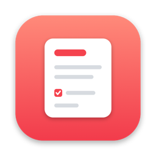
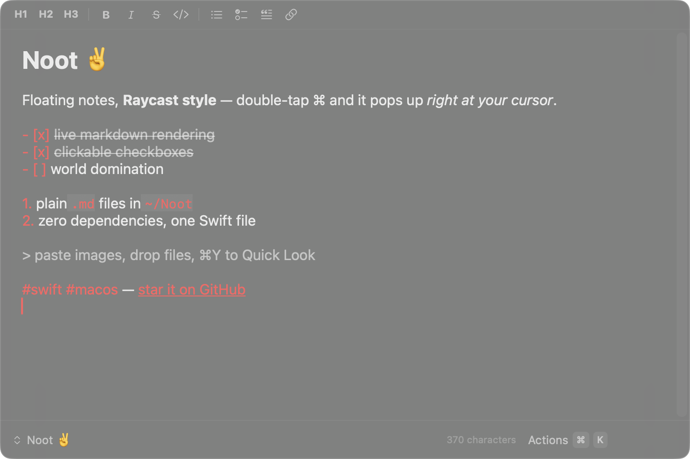

<p align="center">
  
</p>

<h1 align="center">Noot</h1>

<p align="center">Floating markdown scratchpad for macOS, Raycast Notes style.<br>Double-tap <kbd>⌘</kbd> anywhere and start typing.</p>

<p align="center">
  
</p>

## Features

- **Frosted floating panel** — stays above every window and on all Spaces, and never steals focus from the app you're in
- **Live markdown** — syntax markers hide once rendered and reveal on the caret line, Obsidian-style; headings, bold/italic/strikethrough, inline code, fenced blocks, quotes, links
- **Tasks that work** — clickable checkboxes, auto-continued lists on enter, typing `[]` at line start becomes a task item
- **⌘P switcher** — search every note by title or content, arrow keys + enter
- **⌘K actions** — new, duplicate, copy, delete (to Trash), zoom
- **Formatting toolbar** with the shortcuts you expect (⌘B, ⌘I, ⌘E, ⌥⌘1–3…)
- **Daily note** (⇧⌘D) and **clipboard quick-capture** (⌥⌘C → Inbox note, without opening the panel)
- **Images & files** — paste or drag-drop into a note; the file is copied to `~/Noot/assets/` and linked in markdown, click the link to open, ⌘Y to Quick Look
- **`#tags`** — highlighted in every note; click one to see all notes with that tag (or type `#tag` in ⌘P)
- **Link paste** — paste a URL over selected text to get `[text](url)`
- **⌘F** find bar with incremental search
- **Plain files** — every note is a `.md` file in `~/Noot`; no database, no lock-in, no permission prompts
- Menu bar app with switchable icon, launch at login

One Swift file, ~1000 lines, zero dependencies.

## Install

Requires macOS 13+.

```sh
brew install --cask connect-kai/tap/noot
xattr -dr com.apple.quarantine /Applications/Noot.app
```

(The `xattr` line is needed because the app is ad-hoc signed, not notarized — Homebrew 6 removed the `--no-quarantine` flag. Right-click → Open works too.)

Or build from source:

```sh
git clone https://github.com/connect-kai/noot.git
cd noot
./build-app.sh
open ~/Applications/Noot.app
```

Grant the one permission macOS asks for:

- **Accessibility** — needed for the ⌘⌘ global double-tap (System Settings → Privacy & Security → Accessibility). ⌥⌘N works without it.

## Keys

| Key | Action |
|---|---|
| ⌘⌘ or ⌥⌘N | Toggle panel (global) |
| ⌥⌘C | Capture clipboard to Inbox (global) |
| ⌘P | Switch / search notes |
| ⌘K | Actions |
| ⌘N / ⇧⌘D | New note / daily note |
| ⌘B ⌘I ⌘E ⌘⇧X | Bold, italic, code, strikethrough |
| ⌥⌘1/2/3 | Headings |
| ⌘⇧8 / ⌘⇧T / ⌘⇧L | Bullet / task / link |
| ⌘= / ⌘- | Zoom |
| ⌘F / ⌘G | Find in note / find next |
| ⌘Y | Quick Look attachment under caret |
| esc / ⌘W | Hide panel |

## Hacking

Everything is in `Sources/main.swift`. The icon is generated code too: `swift gen-icon.swift out.png` (see `build-app.sh` for the `.icns` pipeline).

Not affiliated with Raycast — just a fan of their Notes UX.

## License

MIT
